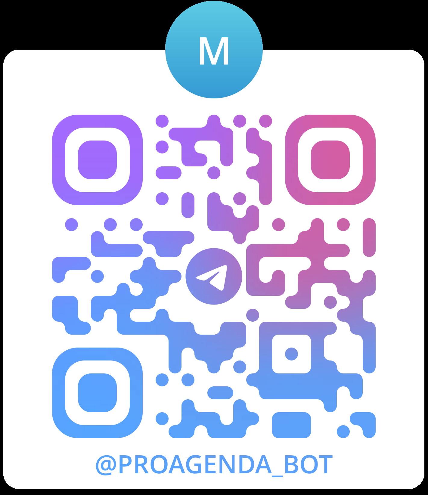

# 🤖 AgendaBot - Sistema de Gestión de Citas y Tareas

[](https://telegram.org/)
[](https://n8n.io/)
[](https://sheets.google.com/)

## 📋 Descripción del Proyecto

AgendaBot es un sistema automatizado de gestión de citas, tareas, hábitos y recordatorios implementado a través de Telegram. Utiliza una arquitectura conversacional basada en menús numéricos que permite a los usuarios organizar su día a día de forma sencilla e intuitiva.

El proyecto está desarrollado sin dependencias de servicios de pago, utilizando únicamente herramientas gratuitas y open-source.

---

## 🚀 Acceso al Bot

### Escanea el QR para comenzar


   

**Nombre del Bot:** `@ProAgenda_bot`  
**Link directo:** `https://t.me/ProAgenda_bot`

> **Nota:** Asegúrate de tener instalado Telegram en tu dispositivo móvil o desktop para interactuar con el bot.

---

## ⚙️ Stack Tecnológico

| Tecnología | Función | Versión |
|-----------|---------|---------|
| **Telegram Bot API** | Interfaz conversacional | Latest |
| **n8n Community Edition** | Motor de automatización | Latest |
| **Google Sheets** | Base de datos | API v4 |

### Restricciones Técnicas

❌ **No se utilizan:**
- n8n Cloud (versión de pago)
- APIs que requieren tarjeta de crédito
- Modelos de ML/AI entrenados
- Embeddings o RAG

---

## 🎯 Funcionalidades Principales

### 1️⃣ Gestión de Agenda
- ✅ Agendar nuevas citas
- ✅ Consultar agenda completa
- ✅ Reprogramar citas existentes
- ✅ Cancelar citas
- ✅ Marcar citas como completadas

### 2️⃣ Gestión de Tareas
- ✅ Crear tareas con prioridades
- ✅ Actualizar estado de tareas
- ✅ Asignar fechas objetivo
- ✅ Seguimiento de progreso

### 3️⃣ Recordatorios y Hábitos
- ✅ Configurar recordatorios automáticos
- ✅ Gestión de hábitos recurrentes
- ✅ Notificaciones programadas

### 4️⃣ Listas y Reportes
- ✅ Crear listas personalizadas
- ✅ Gestionar items de listas
- ✅ Generar reportes diarios/semanales

### 5️⃣ Administración
- ✅ Control de usuarios y roles
- ✅ Registro de logs
- ✅ Configuración del sistema

---

## 📊 Modelo de Datos

El sistema utiliza Google Sheets como base de datos con las siguientes hojas:

### Hojas Principales

| Hoja | Descripción | Campos Principales |
|------|-------------|-------------------|
| **CITAS** | Almacena información de citas agendadas | id_cita, fecha, hora, nombre, motivo, canal, estado |
| **TAREAS** | Gestión de tareas y pendientes | id_tarea, titulo, prioridad, estado, fecha_objetivo |
| **HABITOS** | Control de hábitos y rutinas | id_habito, nombre, frecuencia, hora_recordatorio |
| **LISTAS** | Listas personalizadas del usuario | id_lista, nombre_lista, tipo |
| **ITEMS_LISTA** | Items individuales de cada lista | id_item, id_lista, item, estado |
| **USUARIOS** | Control de acceso y permisos | telegram_user, nombre, rol, permitido |
| **LOGS** | Registro de interacciones | timestamp, telegram_user, pantalla, opcion_elegida |
| **SESSIONS** | Gestión de estado conversacional | telegram_user, pantalla_actual, paso_actual, datos_parciales |

---

## 🗺️ Navegación del Bot

### Menú Principal

```
🏠 MENÚ PRINCIPAL
-----------------
0. Ayuda
1. Agenda (citas)
2. Tareas
3. Recordatorios
4. Hábitos
5. Listas
6. Reportes
7. Configuración
8. Administrador
```

### Ejemplo de Flujo: Agendar Cita

```
1. Usuario selecciona "1" (Agenda)
   ↓
2. Usuario selecciona "1" (Agendar nueva cita)
   ↓
3. Bot solicita: Fecha (YYYY-MM-DD)
   ↓
4. Bot solicita: Hora (HH:MM)
   ↓
5. Bot solicita: Nombre del cliente
   ↓
6. Bot solicita: Motivo de la cita
   ↓
7. Bot solicita: Canal (Presencial/Virtual/Llamada)
   ↓
8. Bot muestra resumen y solicita confirmación
   ↓
9. Cita guardada ✅
```

---

## 🎨 Principios de Diseño Conversacional

### ✨ Características del Bot

1. **Navegación por números:** El usuario siempre elige escribiendo un número
2. **Explicaciones claras:** El bot siempre explica qué hace y qué opciones hay
3. **Sugerencias proactivas:** El bot recomienda la mejor opción cuando es relevante
4. **Sin asunciones:** El bot nunca asume la intención del usuario
5. **Escape fácil:** Siempre hay opción de volver o cancelar (opción 9)

### 📝 Mensajería Humanizada

- Saludos cercanos y amigables
- Instrucciones concisas y claras
- Mensajes de confirmación positivos
- Manejo elegante de errores
- Orientación constante al usuario

---

## 🔧 Arquitectura del Sistema

```
┌─────────────────┐
│   TELEGRAM      │
│   (Usuario)     │
└────────┬────────┘
         │
         ▼
┌─────────────────┐
│   n8n Workflow  │
│   - Router      │
│   - Validators  │
│   - Logic       │
└────────┬────────┘
         │
         ▼
┌─────────────────┐
│  GOOGLE SHEETS  │
│  (Base de Datos)│
└─────────────────┘
```

### Componentes de n8n

- **Router Principal:** Dirige el flujo según pantalla y opción
- **Flujos Wizard:** Guían paso a paso procesos complejos
- **Validadores:** Verifican datos antes de guardar
- **Automatizaciones Cron:** Envían recordatorios programados
- **Logger:** Registra todas las interacciones

---

## 🛡️ Validaciones Implementadas

| Validación | Descripción |
|-----------|-------------|
| **Opción válida** | Verifica que el número corresponda al menú actual |
| **Formato de fecha** | Valida formato YYYY-MM-DD |
| **Formato de hora** | Valida formato HH:MM (24h) |
| **No pasado** | Impide agendar citas en fechas/horas pasadas |
| **Doble reserva** | Evita duplicados en la misma fecha/hora |
| **Confirmación** | Requiere confirmación antes de guardar |
| **Permisos** | Verifica rol y permisos del usuario |

---

## 📦 Estructura del Repositorio

```
Proyecto_IA_Nivel1_SantiagoEimer/
│
├── README.md
├── docs/
│   ├── AgendaBot.md
│   ├── images/
│   │   └── bot-qr.png          # QR del bot
│   ├── arquitectura.md
│   └── manual-usuario.md
│
├── workflows/
│   ├── main-router.json
│   ├── agenda-flow.json
│   ├── tareas-flow.json
│   ├── habitos-flow.json
│   └── recordatorios-cron.json
│
├── evidencias/
│   ├── pruebas-navegacion/
│   ├── pruebas-agendamiento/
│   ├── pruebas-errores/
│   └── logs/
│
└── config/
    └── sheets-template.xlsx
```

---

## 🚦 Instalación y Configuración

### Prerrequisitos

- [ ] Cuenta de Telegram
- [ ] n8n Community Edition instalado
- [ ] Cuenta de Google (para Sheets)
- [ ] Bot de Telegram creado (@BotFather)

### Pasos de Instalación

#### 1. Crear el Bot de Telegram

```bash
# Buscar @BotFather en Telegram
# Enviar comando:
/newbot

# Seguir instrucciones y copiar el TOKEN
```

#### 2. Configurar Google Sheets

1. Crear una copia de la plantilla: `AgendaBot_DB`
2. Configurar las 8 hojas según modelo de datos
3. Obtener credenciales de API de Google
4. Compartir la hoja con la cuenta de servicio

#### 3. Importar Workflows en n8n

```bash
# Abrir n8n
# Ir a Workflows > Import from File
# Importar cada archivo .json de la carpeta workflows/
```

#### 4. Configurar Variables de Entorno

```env
TELEGRAM_BOT_TOKEN=tu_token_aqui
GOOGLE_SHEET_ID=id_de_tu_hoja
N8N_WEBHOOK_URL=https://tu-n8n.com/webhook
```

#### 5. Activar Workflows

- Activar el workflow principal `main-router`
- Activar workflows de automatización (cron)
- Probar con `/start` en Telegram

---

## 🧪 Pruebas Realizadas

### Cobertura de Pruebas

| Tipo de Prueba | Cantidad | Estado |
|----------------|----------|--------|
| Navegación por menús | 30 | ✅ |
| Agendamientos completos | 10 | ✅ |
| Manejo de errores | 10 | ✅ |
| Recordatorios automáticos | 10 | ✅ |
| Control de permisos | 10 | ✅ |

### Evidencias

Todas las pruebas están documentadas en la carpeta `evidencias/` con:
- Capturas de pantalla
- Logs exportados de Google Sheets
- Videos de flujos completos
- Reportes de validación

---


## 👤 Autor

**Eimer Jesus Santiago Hernandez**  
Proyecto IA - Nivel 1  

---

## 📄 Licencia

Este proyecto es de uso académico y está desarrollado como parte del programa de formación en Inteligencia Artificial y Automatización.

---

## 🤝 Contribuciones

Este es un proyecto académico individual. No se aceptan contribuciones externas.

---

## 📞 Soporte

Para dudas o problemas con el bot:
- Telegram: @Eimer_J_Santiago_H
- Email: santiagohdzeimer.97@gmail.com

---


